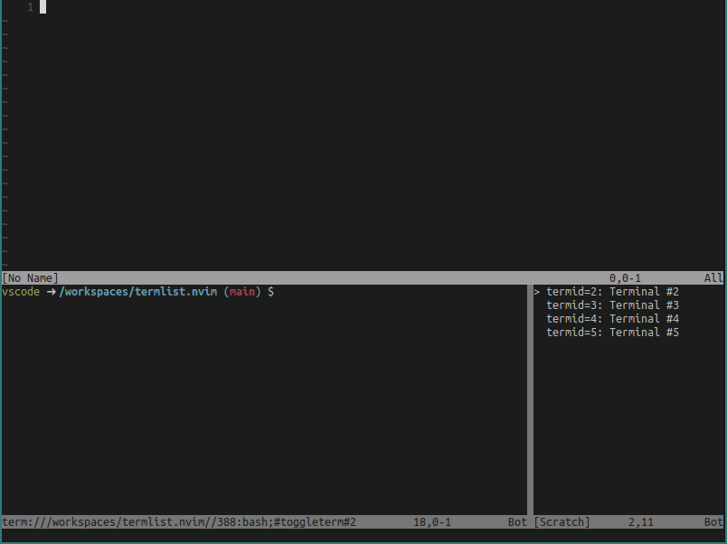

# TermList.nvim

TermList.nvim is a Neovim plugin that provides VSCode-like terminal management.



# Installation

For [lazy.nvim](https://github.com/folke/lazy.nvim)

```lua
  {
    'goropikari/termlist.nvim',
    dependencies = {
      'akinsho/toggleterm.nvim',
    },
    opts = {
      -- default values
      shell = "bash",
      keymaps = {
        toggle   = "<C-t>",
        select   = "<CR>",
        shutdown = "D",
        rename   = "r",
        add      = "<C-n>",
      },
      height_ratio = 0.35,
    },
    -- optional: keymaps
    keys = {
      {
        '<c-t>',
        function()
          require('termlist').toggle()
        end,
        mode = { 'n', 't' },
      },
      {
        '<leader>ss',
        function()
          require('termlist').send_current_line()
        end,
        desc = 'Send current line to termlist',
        mode = { 'n' },
      },
      {
        '<leader>ss',
        function(opts)
          require('termlist').send_visual_text(opts)
        end,
        desc = 'Send visual text to termlist',
        mode = { 'v' },
      },
    },
  },

```

# Usage

## Open / Close the terminal manager

```lua
:lua require("termlist").toggle()
```

## Default Keymaps (in terminal list window)

- `<CR>`: Select terminal
- `D`: Shutdown terminal
- `r`: Rename terminal
- `<C-n>`: Add new terminal
